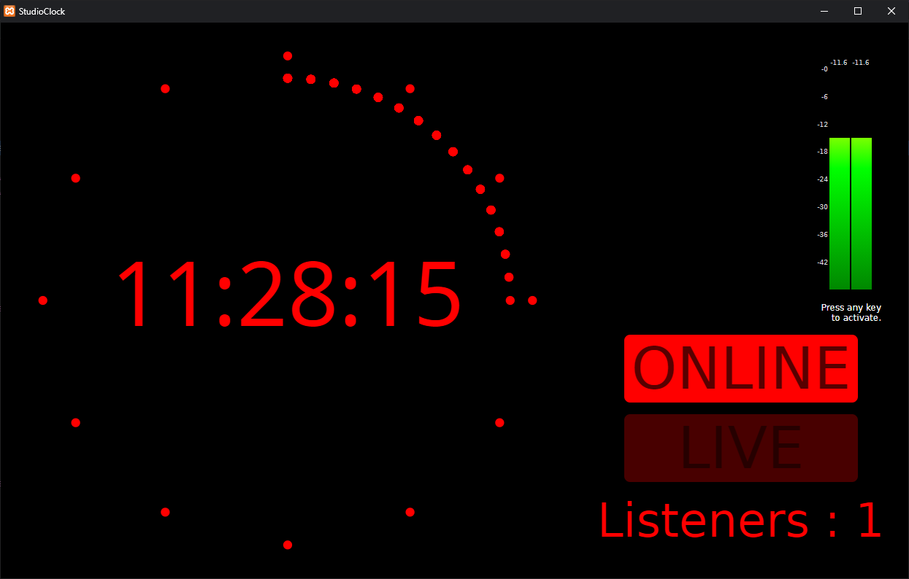
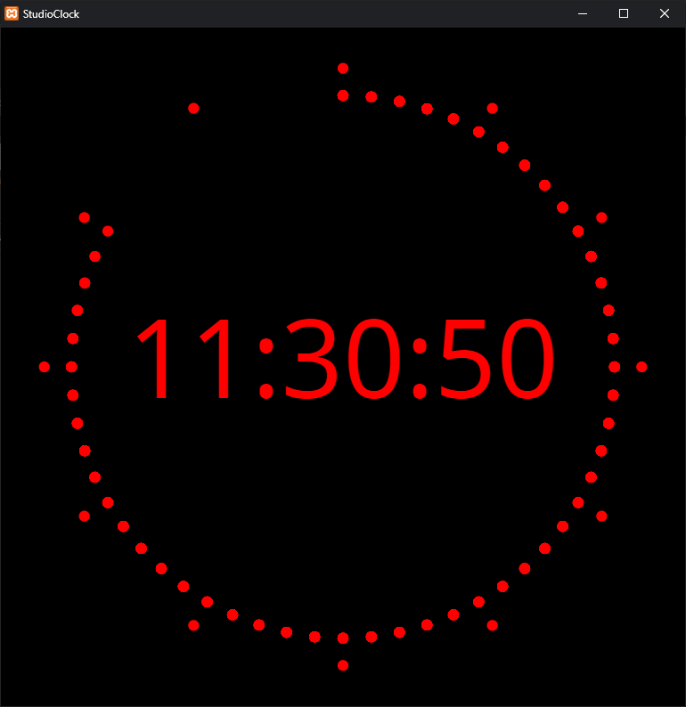

# StudioClock

This is a HTML/JavaScript studio clock for your WebRadio.

You just have to clone this repo and point a Web browser to StudioClock.html to display the clock using the machines time (no online time sync included).

It comes with some supervision tools for Azuracast servers and generic MP3 audio streams.  
To enable them, you just have to modify the JSON element of the StudioClock.html file.
* Set "activate_supervision_tools" to true,
* Replace "stream_URL" by your audio stream URL (it should be in MP3 format). This should work for any MP3 stream, not only Azuracast ones
* Replace "live_API_URL" by your Azuracast radio live API URL.  
It usually looks like that : https://your.azuracast.server.address/api/live/nowplaying/radio_name
* The "name" parameter is currently unused but might be in the future.

You can display it without the Web browser GUI (URL bar an navigation buttons) by running the chrome (chromium on Linux) browser with the following option :

  --app=file://file_path/StudioClock.html

This is how it looks with the tools configured:

This is how it looks without:

